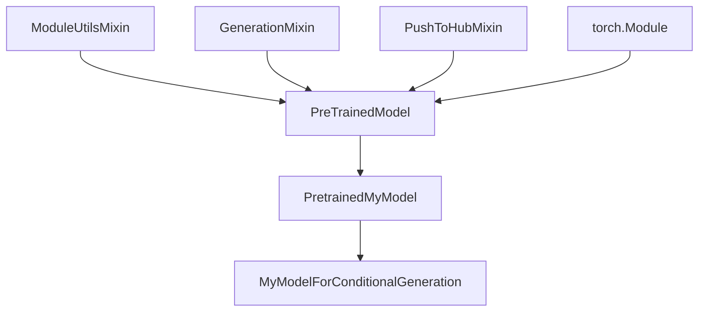
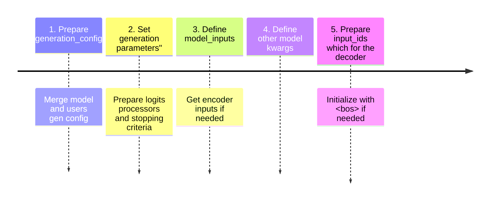
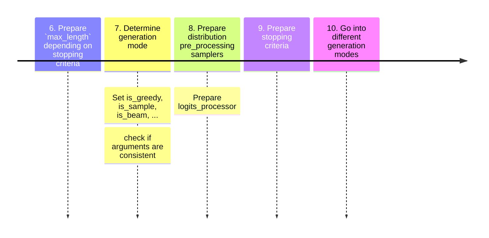
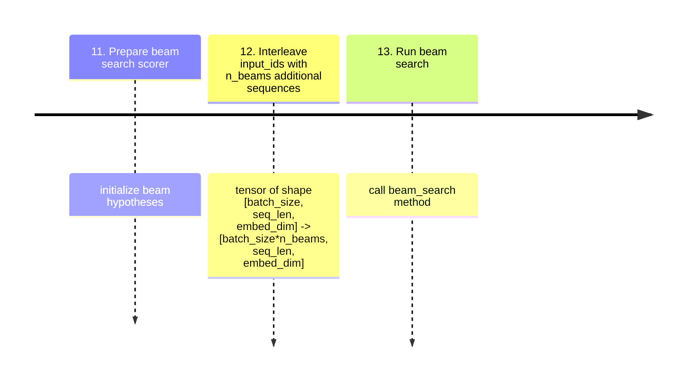

While implementing a new generation strategy for Transformer models, I found myself delving deep into the HuggingFace library. The documentation is clear with respect to the usage, but not so much with respect to the implementation details.

Here is a collection of notes I've compiled from my dive into the codebase. This may prove beneficial for anyone looking to understand or extend HuggingFace's generation pipeline.

<!-- more -->

### The overall class structure

HuggingFace Transformer models have all one common ancestor: `PreTrainedModel`. This class is defined in `transformers/modeling_utils.py`. It is a subclass of `torch.nn.Module`, `ModuleUtilsMixin`, `GenerationMixin` and `PushToHubMixin`.

The generation pipeline for all Transformer models is centralized in `GenerationMixin`. This class is defined in `transformers/generation/utils.py`, and all models must implement `prepare_inputs_for_generation`. Additionally, models can implement `adjust_logits_during_generation` and `_reorder_cache`.

The main method in `GenerationMixin` is `generate`, which orchestrates the generation process and then calls the different specialized methods such as `contrastive_search`, `greedy_search`, `sample`, `beam_search`, `beam_sample`, `group_beam_search`, `constrained_beam_search` and `assisted_decoding`.

### The generation pipeline

Let's break down the generation pipeline into its different steps. Note that these steps are written with the same numbers into the code comments.[This is a permalink](https://github.com/huggingface/transformers/blob/d13021e35fb391c88c48b085f29462625d8f4090/src/transformers/generation/utils.py#L1146) to the generate method being analyzed in this post (note that HF is a fast moving target, so some details may be outdated soon).

Another vital point to note is that the generation happens in batches, meaning that the input_ids have a shape of `(batch_size, seq_len, embed_dim)`. This is to allow, for example, to translate multiple sentences at once.

The `logits_processor` is a list of functions that are applied to the logits before selecting or sampling the next token. There is also a `logits_warper` that is applied to the logits ***after*** the `logits_processor` but only in stochastic generation modes (`sample`, `beam_sample`, `assisted_decoding`, `constraint_beam_search` and `contrastive_search`). Also, in `beam_sample` mode, `logits_processor` is applied to the logits, but then the logits are integrated into the beam search scores, and the `logits_warper` is applied to the beam search scores.

### The beam_search generation mode

The beam search generation mode has two main components: 
- The `beam_search` method, found in `GenerationMixin`, handles the primary decoding loop, maintains the beam scores and calls the model (referenced in step 13 of `generate`).
- In `transformers/generation/beam_search.py`, BeamSearchScorer has one BeamHypotheses object for each sequence in the batch. It is a general construction that makes sense for generalizing beam search to diverse_beam_search (keep different groups of beams to ensure diversity).
  - The BeamHypotheses keeps the list of the `n_beams` best hypotheses for each sequence in the batch, with its beam scores and beam indices.

### The beam_search method

1. Initialize the beam_scores to 0 as a tensor of dimension `(batch_size, n_beams)`.
2. Set beam_scores to $-\infty$ for all beams except the first one (`beam_scores[:,1:] = -1e9`).
3. View beam_scores as a 1D tensor of dimension `(batch_size*n_beams)`.
4. Generation loop:
    1. Run the model, get outputs for the next token over all beams of all sequences in the batch.
    2. Locally normalize the output (apply log_softmax).
    3. Apply the `logits_processor` to the logits.
    4. Append the new logits to the running beam scores. Note that now we have a tensor of dimension `(batch_size*n_beams, vocab_size)`.
    5. To form the next_token_scores, view as a tensor of dimension `(batch_size, n_beams*vocab_size)`.
    6. Get the `2*n_beams` best scores from next_token_scores by applying `torch.topk`. Derive the beam indices and token indices.
    7. Call `beam_scorer.process` to update the beam hypotheses. Get the new beam scores, indices and next_tokens for each beam. Update `input_ids` with the new tokens.
    8. If all beams are finished or the stopping criteria are met, break the loop.

### The BeamScorer process method
This method is defined in `transformers/generation/beam_search.py` and takes as output the `2*n_beams` topk elements and indexes calculated above. The beam search scorer is initialized with a `BeamHypotheses` object for each sequence in the batch.

1. Create new tensors for the next scores, tokens and indices of dimension `(batch_size, group_size)` (this is because of diverse beam search, we know `group_size`=`n_beams` for normal beam search. In this case, the tensors have dimension `(batch_size, n_beams)`).
2. For each beam hypotheses object in the scorer (i.e. for each sentence in the batch):
    1. If the sentence is finished, do nothing and continue to the next sentence.
    2. For each (token, score, index) in the top `2*n_beams` next scores among the `n_beams*vocab_size` scores:
        1. If the token is the EOS token, check if the beam is still among the `n_beams` best beams. If so, add the beam to the list of hypotheses of the sentence. The beam_score for this beam would be 0, since it moves from the running beams to the finished beams.  
        2. If the token is not the EOS token, add the token, score and beam_index to the next scores, tokens and indices tensors. If we have already all the running beams, break the loop (remember that we started from the top scores, so we only want to keep the `n_beams` best finished beams and the `n_beams` best running beams).
    
We can see how the beam_hypotheses keep the `n_beams` best finished beams, while the `n_beams` best running beams are kept in the `next_scores`, `next_tokens` and `next_indices` tensors, which are sent back and forth between the `beam_search` method and the `process` method, as the main loop from the `beam_search` progresses through the running beams.

### The interesting (and obscure) bits
Why do we need to select the `2*n_beams` best beams? We might encounter situations where `n_beams` number of sequences reach `<EOS>`, leaving no live sequences to continue. With `2*n_beams`, this will not happen. This is important because we want to keep `n_beams` beams alive (hypotheses) for each sequence in the batch, until we find that the worst finished beam is better than the best alive beam. This is the stopping criteria of the beam search. 

Interestingly, the beam search in HuggingFace was adapted from facebookresearch/XLM. You can check out [the original commit here](https://github.com/huggingface/transformers/commit/b6938916ac7f00cd260e70d54b252909c40bced6).