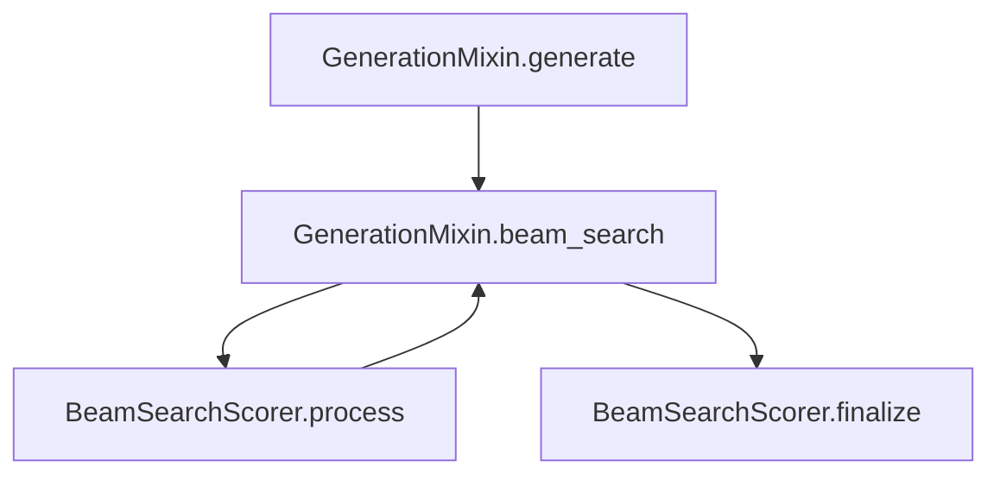

[Stochastic beam search](https://arxiv.org/pdf/1903.06059.pdf) is a principled way of getting a sample-without-replacement from an autoregressive model, just by perturbing the scores of the beam search algorithm. This allows to construct low-variance estimators over the model's distribution, which can be useful to estimate model's properties and explore stochastic strategies for generation.

<!-- more -->

### Stochastic beam search in a nutshell

The algorithm boils down to perturbing the *accumulated log-probabilities* of the beam search algorithm. Thanks to the [topk Gumbel trick](https://timvieira.github.io/blog/post/2014/08/01/gumbel-max-trick-and-weighted-reservoir-sampling), we know that top-k samples with respect to the perturbed accumulated log-probabilities have the distribution of a sample without replacement from the model. This is like a magic trick🪄!! What if we could get the top-k perturbed log-probabilities without exploring the whole search space? Well, that's exactly what the stochastic beam search algorithm does.

Two particular observations that are not very obvious at first sight:
- The algorithm relies on the probabilities being locally normalized at each generation step, so that the beam scores are the actual log-probabilities of the partially-generated sequences. [The original Gumbel trick](https://timvieira.github.io/blog/post/2014/07/31/gumbel-max-trick/) was applied to the unnormalized logits, but this is a different application!
- The key observation of SBS is that the Gumbel perturbations can be computed hierarchically and depend *only* on the beam scores, and since $p(\<\text{BOS}\>)=1$, we can compute the perturbation for the first step and then downstream efficiently. This is why we need the scores to be normalized, so that we can know the probability of the root node beforehand!

(copy here the ipad diagram)

### Porting to 🤗 generation pipeline

Taking a practical approach, we might first think that we can use just a `LogitsProcessor` to perturb the logits and then use the standard beam search implementation. Two problems arise:
- Computing the Gumbel perturbations requires the perturbation of the parent node in the generation tree. This is not possible with the current `LogitsProcessor` API, which only allows to modify the logits of the current node without further context.
- We cannot return the perturbed logits as the new logits, since we need to keep track of the original logits to compute the perturbations for the next step.

The following assumes familiarity with the HF generation pipeline, which I distilled in [this post](https://manueldeprada.com/blog/posts/documenting-hf-generate/). 

Ideally, we would like to generalize the beam search algorithm to allow for:
- A `LogitsProcessor` that can modify the logits of the current node with more context (getting all the generated past logits).
- A more flexible `beam_search` method that keeps track of the log-probabilities as the beam scores and, separately, the processed logits which are used ***only*** for selecting the top-k candidates, so that they don't affect the true beam scores. A flag into the `beam_search` method would allow to disable using the processed logits as beam scores, so the default behavior would be the standard beam search.

The second point requires careful consideration, since the selection among *finished beams* happens inside `BeamSearchScorer`. However, the selection among *active beams* comes from the `torch.topk` call in `GenerationMixin.beam_search`. 

We should pass the perturbed logits to the `BeamSearchScorer`. It must save them into the `BeamHypotheses` object, so that only the highest perturbed-logprob *finished* beams are kept. The call to `torch.topk` should also be modified to use the perturbed logits, so that the *active* beams are selected according to the perturbed logits.
However, when `BeamSearchScorer` returns the updated active beam scores, we should use the original unperturbed scores. 

We also should look carefully to see what scores are being used in the `BeamSearchScorer.finalize` method.

Since we are looking into generalizing the beam search algorithm, it may make sense to not just pass to the `LogitsProcessor` the past processed logits, but also the past true beam scores. This would allow to implement other algorithms that require the past beam scores. Furthermore, it would also be nice for extensibility being able to provide our own BeamSearchScorer class.